= Particle music

== Propósito

El propósito de este documento es intentar _entender cómo funciona la música_. Es un proyecto personal, guiado simplemente por mi propia curiosidad y por mi afición musical. No pretendo cambiar la forma en que se estudia y enseña música, pero quizá no estaría mal revisar algunas cosas que vienen haciéndose igual durante siglos. +
Lógicamente, se puede argumentar que, si algo funciona, para qué cambiarlo. El problema es que _no funciona_. Cualquier persona que se plantee el estudio musical desde cualquier perspectiva, clásica en un conservatorio, jazz en una escuela, electrónica en un laboratorio, o simplemente tocando con amigos en un local de ensayo, encontrará las mismas insatisfactorias viejas respuestas a algunas preguntas que parecen ya abandonadas por imposibles. +
Me refiero a respuestas del tipo “_Se puede hacer así..._” o “_Se suele hacer así_” o “_Siempre se ha hecho así_”, o mucho peor aún, “_Tal compositor lo hizo así_”. Evidentemente, nuestro conocimiento de la música no funciona. Somos capaces de componerla, interpretarla, escribirla y disfrutarla, pero no la entendemos. En absoluto. +
Tengo la convicción de que la música es un descubrimiento del ser humano, no un invento. +
La notación y el compendio teórico que se usan en la actualidad proceden del pasado, donde tampoco la entendía nadie, y evidentemente no son herramientas pensadas para entenderla. Basta con que sirvan para componer, escribir, interpretar y transmitir. Para eso sí funcionan, de hecho, bastante bien. +
Para entenderla, no solo no funcionan, sino que dificultan la tarea hasta el absurdo. Desde los nombres de las notas, las escalas, los acordes, las cadencias, los estilos, hasta el mismo pentagrama y sus estrafalarios símbolos. +
Del mismo modo que Copérnico facilitó la comprensión del sistema solar, simplemente cambiando el punto de vista, yo creo (salvando las distancias, astronómicas, por cierto) que se debería cambiar el punto de vista para entender la música, y me explico: +
pensar que se trata de un invento del capricho humano nos lleva por el camino equivocado, empezando ya por ordenar las notas erróneamente. Tomamos el DO (en la escala natural) como nota inicial, y además le llamamos _fundamental_ solo porque nos parece que “suena bien”, porque nos da una agradable sensación de descanso, terminación y completitud.  +
Sería equivalente a ordenar los planetas por lo bonitos que son. +
La música es armonía matemática (sus reglas no pueden cambiarse), no es un arte decorativo disponible para nuestros caprichos. Sus reglas forman un sistema perfecto, y tienen una estructura interna perfectamente lógica y exacta, no podemos cambiar su orden por uno que nos resulte más agradable, lo que necesitamos es descubrir cuál es ese orden interno.

== Simplificación

En general, el estudio de la música se realiza mediante una serie de conceptos, palabras, símbolos y notaciones que proceden de hace varios siglos. Las reglas se han ido superponiendo según cada compositor iba rompiendo las anteriores. Todo lo que se usa es un poco farragoso y falto de un método científico. Intentaremos simplificarlo un poco, creando una notación más simple, una teoría más clara y sobre todo, que explique de verdad qué es lo que estamos escuchando, sin recurrir nunca a explicaciones caprichosas.

== Reglas matemáticas

En la música todo tiene una razón. Insisto: no es un invento del ser humano, es un descubrimiento. Tiene reglas matemáticas y no podemos cambiarlas. +
Es importante no utilizar conceptos como “_suena bien_” o “_suena mal_”. Esos conceptos nos llevarían por el camino equivocado al analizar, por ejemplo, la escala como un conjunto de notas que comienza y termina en una nota por la única curiosa razón de que esa nota nos produce a nosotros una impresión de descanso o estabilidad. 

== Física y sentido común

Las reglas que rigen la física del mundo en que vivimos influyen completamente en la forma como interpretamos la música. Si algo nos suena conocido intentamos compararlo, catalogarlo, etiquetarlo, asimilarlo. Por eso, la música sirve para expresar ideas, porque recuerda, simula, revive o reconstruye sensaciones del mundo real. Así que no solamente podemos expresar conceptos como grave/agudo, rápido/lento o fuerte/débil. También podemos _evocar_ escenas del mundo real. Cuando decimos que una música nos gusta, suele deberse a que representa cosas que nos gustan, nos recuerda a escenas interesantes o a realidades agradables.  +
Si los números pudiesen expresar la belleza que esconden, podríamos hablar de lo bonito que es un número por ser primo, por ser la raiz de otro, o por cualquier otra razón puramente matemática. Pero no parece muy serio pretender que los números son más bonitos si nos recuerdan una fecha feliz, o si nos han tocado en un sorteo de la lotería. Sin embargo calificamos la música de esa forma, porque, además de ser un sistema matemático, es un lenguaje que nos permite expresar ideas.  +
Dicho de otro modo, la música nos permite emular conceptos que son externos a su propia estructura, por simple parecido a las estructuras de dichos conceptos. Igual que con un lápiz podemos dibujar un gato, mejor dicho, realizar un trazado que a un humano le sugiera, de forma inequívoca y fácilmente analizable, el concepto de “gato”, con música podemos realizar combinaciones de notas que nos sugieran conceptos como “alegría”, “dolor”, “vértigo”, “esperanza”, aunque de forma más abstracta, es decir, que nos resulta dificil explicar por qué experimentamos esas percepciones, simplemente nos quedamos en que la música realmente nos sugiere eso. Pero lo hace por simple parecido, igual que el dibujo del gato: hay algo en común entre la estructura interna del concepto de “alegría” por ejemplo, y una música determinada.

En el universo que habitamos hay algunas reglas establecidas que solemos dar por supuestas, aunque podrían no estar ahí. Recordemos unas cuantas reglas de sentido común:

* Las cosas tienen una masa y un volumen. 
* Las cosas grandes pesan más que las pequeñas
* Las cosas pequeñas se mueven más fácilmente que las grandes
* Las cosas grandes suelen estar abajo, las pequeñas arriba
* Las cosas pequeñas suelen ser frágiles, las grandes fuertes
* Los seres vivos son frágiles
* La luz suele estar arriba, la oscuridad abajo
* Los cuerpos muertos suelen estar abajo
* etc, etc.
Todas estas ideas están en nuestro cerebro durante toda nuestra vida, y nos sirven para sobrevivir a la realidad. Así que las utilizamos, casi siempre de forma inconsciente para interpretar lo que vemos, rechazar lo que tememos, jugar al tenis o beber un vaso de agua. Lógicamente, forman parte de nuestro lenguaje musical, y además no se necesita ningún traductor: todos los seres humanos las conocen. Por eso la música es un lenguaje universal, porque utiliza palabras que cualquier habitante del mundo real puede reconocer.

== Escala

Las ondas de sonido proceden de elementos físicos que vibran. Cuerdas, campanas, tubos, etc. Casi ningún elemento vibra de una forma perfecta, formando una onda senoidal, sino que tienen lo que se dice un timbre determinado, es decir, una forma de onda propia. La forma de una onda depende de la cantidad de armónicos que se superpongan a la vibración principal, es decir, de vibraciones simultaneas a velocidades múltiplos de la velocidad base. Así diferenciamos el sonido de un violín del de un saxo, porque tienen diferentes armónicos. Si una onda vibra a una velocidad múltiplo de otra, se combinan formando un sonido uniforme y reconocible, así que decimos que forman armonía. Hay varias mezclas posibles que resultan armónicas, basándose en la proporción matemática entre ellas. Por ejemplo, si una nota vibra 440 veces por segundo y otra 880 forman una armonía perfecta. Pero no ocurre lo mismo con 440 y 457, por ejemplo. El oido separa las dos y detecta que no forman una proporción matemática reconocible. Podríamos calificar de armónicas las proporciones justas, es decir, el doble, el triple, el cuádruple, etc.  +
Si tomamos los armónicos que se generan desde una onda base al agregarle más ondas que sean múltiplos de la misma, obtenemos una escala. Está ahí, no se puede cambiar.  +
Ese conjunto de notas es el que utilizamos para hacer música, notas que mantienen una relación matemática entre ellas. +
Así pues, una _escala_ es un conjunto de notas basado en los armónicos naturales. Hay 12 notas, puesto que a partir de ahí, comienzan a repetirse. De entre las 12 se selecciona un subconjunto, generalmente de 7 notas, que nos permite formar un “mapa” que tiene una serie de propiedades muy útiles que veremos más adelante.

== Tonalidad

Se llama _tonalidad_ a la escala seleccionada en cada momento, el oyente la asimila en conjunto, haciéndose una idea de situación. Las proporciones entre las notas forman un esquema perfecto que actúa como un mapa,  y que permite al oyente orientarse al escuchar el mensaje musical. La mayor parte de la música está en una sola tonalidad, pero es muy habitual cambiarla sobre la marcha. Su función como mapa se incrementa si la escala es simetrica, de la misma forma que asimilamos más fácilmente un mapa regular como un callejero que un mapa irregular de una zona montañosa. 

== Escucha predictiva

Escuchamos la música realizando adivinación del futuro. En un cuadro, los datos están ahí. No hay más que dirigir la vista a cada punto y los trazos están ahí, expresando lo que el pintor desea que expresen. En la música es diferente. Antes de empezar no tenemos nada. Solo silencio. En cuanto empieza la obra es como si comenzase un viaje, que va avanzando, sonido a sonido, por un raro espacio desconocido.  +
Con cada nota recibimos un estímulo nuevo. Antes no estaba y de pronto aparece. Necesitamos asimilarlo, a veces a una velocidad endiablada. +
Los estímulos inesperados nos producen sorpresa, y nos obligan a su análisis. Debemos dedicar un poco de tiempo de proceso cerebral para saber cómo encaja esa nota con las demás, si es que encaja, o de lo contrario, cambiar todas las suposiciones anteriores para hacerla encajar. Si adivinamos cada nota, nos aburrimos. Si cada nota nos sorprende, nos cansamos y perdemos el hilo. Si hay una proporcion adecuada entre ambas situaciones, la música nos resulta familiar pero estimulante. Posiblemente tenga éxito.

== Tríada

Se le llama _tono_ a la distancia que hay entre dos notas alternas y _semitono_ a la distancia entre dos notas contigüas ( si hablásemos de números, entre 18 y 19 habría un semitono, pero entre 15 y 17 habría un tono).  +
Una _tríada_ es un acorde (notas que suenan simultaneamente) de tres notas alternas de una escala (una vez más, pensando en números, podrían ser 1, 3 y 5, ó 25, 27 y 29). En la notación estandar, se dice que sus notas están a distancia de una tercera, si es de dos tonos se llama tercera _mayor_, si es de tono y medio se llama tercera _menor_. Una tríada tiene pues dos intervalos, el que hay entre la primera y la segunda nota y el que hay entre la segunda y la tercera. Si esos intervalos son, de abajo a arriba, mayor y menor se dice que es un acorde mayor. Si son menor y mayor se llama acorde menor.  +
Uno se siente casi avergonzado de tener que recurrir a toda esta dieciochesca terminología que debería dejar de usarse cuanto antes pero “así se ha hecho siempre”. Ya hemos dicho que sería mejor encontrar algo un poco más simple y natural.

== Estructura mayor/menor y su significado

.Esquema geométrico de las tríadas 

El caso es que las tríadas, son la estructura musical más utilizada en la música. No ofrecen ninguna duda, son como los átomos con los que se forma el resto de la materia: son indivisibles ( no hay nada con una estructura más básica ) e incluso cuando no están, el cerebro acaba encontrándo su huella. Forman la base sobre la que se asienta la música. +
Las tríadas mayores forman una estructura menor/mayor (menor sobre mayor)  +
Las tríadas menores forman una estructura mayor/menor (mayor sobre menor) +
El subconsciente toma estas estructuras como formas reales e intenta intrepretarlas. +
Es muy fácil observar esto con cualquier instrumento. Escuchar un acorde mayor y el mismo menor y preguntarse por qué el acorde mayor sugiere alegría y el menor tristeza es la primera pregunta que debemos hacernos, y no aceptar respuestas “mágicas”. Durante años, he escuchado muchas respuestas a esta cuestión, la más torpe la que dice que los temas fúnebres siempre se han hecho con acordes menores y los temas festivos con acordes mayores. A esta clase de “respuestas” me refiero.  +
Para mí está muy claro que se trata de una simple estructura de algo grande colocado encima de algo pequeño, o al revés. Cuando escucho el acorde puedo verlo claramente, y si miro a las figuras todavía más, incluso puedo escuchar los acordes simplemente mirándolas. En el mundo en que vivimos, una cosa grande sobre una pequeña es algo... injusto, no está bien, no es correcto, da la impresión de que se necesita actuar, acudir en su auxilio, resolver su problema, dejar las cosas en su equilibrio natural. No es algo necesariamente inestable, ese no es el problema, sino algo incorrecto, algo que nos hace sentir de alguna forma insatisfechos, tristes. +
Se trata de dos entidades diferentes. Una es más grande que la otra, y la más grande está encima de la más pequeña. Sea lo que sea: dos piedras, dos cajas, dos personas, dos organizaciones, dos paises... no es justo. La idea “estar encima de” en el mundo real sugiere peso, gravedad, opresión, aguante, dominación, esclavitud. Es una de las reglas de sentido común. Lo normal, es que las entidades pequeñas se apoyen en las grandes, que utilicen su poder, tamaño, altura y equilibrio. La vida sigue gracias a que los grandes soportan y apoyan a los pequeños, los adultos a los niños, los poderosos a los pobres, y no al revés. Ver a un poderoso subido a la espalda de un niño es la imagen más triste y dramática que uno puede imaginar, lo contrario es una bella idea de colaboración, amistad, generosidad y vida. +
Esos acordes están presentes en el 99% de la música, e incluso, cuando no estan presentes, el oyente intenta imaginarlos, como cuando faltan trazos en una imagen y nuestra imaginación completa los que faltan basándose en el sentido común. Cuando escuchamos una tríada mayor o menor admitimos esas ideas por sistema, y, a partir de ellas, intentamos entender qué nos está contando la música, además de orientarnos en el mapa que forman.  +
En fin, estas son las ideas que sugieren automáticamente esas tres simples notas:

|===
|*_Tríada menor_*|*_Tríada mayor_*

|Injusticia|Justicia
|Tristeza|Alegría
|Fracaso|Triunfo
|Muerte|Vida
|Opresión|Solidaridad
|===

== Tríadas orientativas

El formato de una tríada, nos permite suponer en qué grado de la escala estamos. En una escala hay algunas tríadas mayores y otras menores. Se obtienen simplemente agregando a cada grado de la escala las dos siguientes notas alternas. Según el caracter de la tríada que oímos, podemos suponer en qué grado de la escala podemos estar ( como cuando al ver un monumento en un mapa de pronto nos orientamos correctamente ). Como hay varias tríadas de cada tipo, todavía hay _lugar para el engaño_.

== Tritono

Un tritono está formado por dos notas a 3 tonos de distancia. Entre ambas, caben dos terceras menores. Sería algo así como una estructura _menor / menor_. No sirve para expresar el caracter de una tríada normal, es equívoco, puesto que se puede invertir y queda igual. El oyente intenta suponer que se va a convertir en una tríada normal. Eso, en música se llama _resolver_.  +
Cuando estamos hablando y deseamos que la persona que nos está escuchando intente encontrar una solución... ¿Qué hacemos? ¿Colocamos el problema entre signos de interrogación y esperamos a que nos dé una respuesta? ¿Eh?. Se llaman preguntas, y las hacemos a diario.  +
Pues en la música también existen las preguntas. Son acordes sin resolver, acordes que no forman una estructura mayor ni menor, y que deben desaparecer cuanto antes o el oyente sentirá que falta algo.  +
En una escala donde dos notas alternas queden a 3 tonos de distancia, el acorde que se formará en ese grado sonará raro, sin resolver. Qué casualidad: en la escala mayor (la que conoce todo el mundo, la que forman las teclas blancas del piano, _do, re, mi, fa_...) hay un grado en que se forma un tritono: el grado 7, el de la nota _si_. Las notas alternas a partir de _si _son _re _y _fa_. Entre cada par hay tono y medio, así que en total son 3 tonos, es decir, dos terceras menores una sobre la otra. Nadie querrá terminar una canción con ese acorde. +
Ningúna actuación musical terminará nunca (al menos si queremos que el público empiece a aplaudir ) con un acorde sin resolver. El oyente espera a que le demos una solución. Unas milésimas de segundo antes, imagina cuál vamos a darle. Si acierta se sentirá satisfecho, si no se sorprenderá. Muchas preguntas le resultarán demasiado estimulantes y probablemente se sature. Ninguna pregunta hará que pierda el interés.

== Repulsión del tritono

Un tritono suena repulsivo, dos terceras menores no representan nada apiladas.  +
Tienta al oyente a adivinar en qué se resolverá, le hace participar, le hace arriesgarse y posibilita engañarle y sorprenderle resolviéndolo de manera inesperada.  +
Invade su tranquilidad, requiriendo de él una escucha activa y arriesgada. Le condena a equivocarse sin poder evitarlo. Es como el “_nada por aqui... nada por allá_...” de los magos. +
En la edad media, a ese sonido se le llamaba "_Diabolus in musicae_". Solo el nombre ya denota el caracter molesto e incluso peligroso que puede llegar a tener, sobre todo si eres un estado medieval y utilizas la música para mantener adormecida a la masa. Prohibir el tritono es como cuando en el cine el poli malo dice “Aquí soy yo el que hace las preguntas!”.

== Distancia al tritono

Es la distancia que un grado de la escala mantiene con respecto a algún tritono. Si en una escala hay un solo tritono, habrá grados que estén a mucha distancia de él, pero si hay dos, al alejarnos de uno nos acercamos al otro, así que siempre estaremos cerca de alguno.  +
Los grados que quedan muy lejos de algún tritono sugieren estabilidad, relax. Hay escalas que no contienen ningún tritono. La sensación de linealidad y estabilidad (y posiblemente monotonía) es bastante fuerte en ellas. No es casual que las usáramos en nuestros estados primitivos de civilización. Profundizaremos en esto más adelante.

== Orientación erronea

En la notación tradicional, al grado más lejano al tritono se le llama _fundamental_, y además se considera que la escala comienza y termina en ese grado. Esto es un error grave; que un grado esté lejos de un tritono no significa que sea el principio. Se hace porque el oyente se siente cómodo cuando una canción termina en el grado fundamental, como suele ocurrir. Como ya hemos dicho, este es uno de los errores graves que queremos solucionar: el ángulo desde el que se ve la música, el excesivo protagonismo del oyente, (evidentemente porque es el que paga y el que decide si el compositor triunfará o no). En todo caso, necesitamos seguir componiendo música para humanos, así que deberemos seguir teniendo en cuenta lo que les hace sentir cómodos o lo que no, pero necesitamos entender por qué.

== Orientación simétrica

Las escalas que usamos son simétricas. La simetría es un patrón que ayuda al oyente a reconocer la armonía. Si una escala es simétrica, nos ayudará mucho en su análisis usar una notación que respete esta simetría, donde el punto central se represente gráficamente en el centro. En la notación que presentamos, esta idea es muy importante.

== Modos de una escala

Se llaman _modos_ a las distintas orientaciones de una escala, es decir, tomar las mismas notas pero cambiando la nota inicial. Debe eliminarse por completo este concepto. Es mucho más simple y util reducir la cantidad de escalas a analizar y asimilar. Solamente hay seis escalas.

== Escalas

Eliminando el concepto de _modo_ de una escala, estas son las escalas que se usan habitualmente y los nombres que se le han asignado. En notación estandar, la equivalencia sería la siguiente:

|===
|*ESCALA*|*NOMBRE ESTANDAR*

|WHITE |Escala _diatónica_
|BLUE |Escala menor _melódica_
|RED |Escala menor _armónica_
|BLACK |Escala _disminuida_
|PENTA |Escala _pentatónica_
|TONES |Escala por _tonos_
|===

En la notación creada se representan los grados de la escala como números. Se ha de prestar atención a que el primer grado de la escala no es, como en la notación tradicional, el grado más lejano al tritono (en la escala diatónica sería el DO), sino el grado que, como muestran las figuras, ocupa el centro de la estructura (en la escala diatónica sería el RE). Partiendo de la nota inicial y girando en sentido agujas del reloj se sube de tono hasta que se vuelve al tono inicial, es decir, se sube una octava. Téngase en cuenta que en la escala BLACK, la simetría no se basa en las notas, sino en el espacio entre ellas, y no hay una nota central, sino un espacio entre notas central. La sensación de simetría que percibe el oyente es idéntica y la notación así lo refleja. +
Esta notación es muy sencilla, portable y práctica. De un solo vistazo, se puede observar la simetría de todas las escalas. Si se compara con la notación tradicional, donde no se aprecia simetría alguna, se notará una increible mejoría en las posibilidades que ofrece para su análisis, estudio y asimilación.

.The six scales
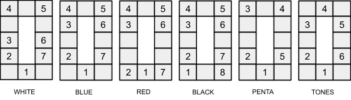

== Nombres de las notas

Representaremos las notas de la escala mediante la notación americana, es decir, usando las letras desde la A hasta la G, pero con una pequeña modificación: no hay _sostenidos_.

|===
|A|A♯|B|C|C♯|D|D♯|E|F|F♯|G|G♯

|A|b|B|C|d|D|e|E|F|g|G|a
|===

En la notación estandar, cuando se quiere subir una nota un semitono se le pone el signo de sostenido (♯) y cuando se desea bajarla un semitono, se le agrega un bemol (♭), así que DO♯ es en realidad la misma nota que RE♭. +
En nuestra notación, para indicar bemoles usamos la misma letra pero en minúscula. Así que en una misma escala se puede encontrar una nota natural y también la misma nota bemol. Por ejemplo: +

----
    A = LA 
    B = SI 
    b = SI bemol 
----

Esta sería la representación de la escala `BLUE` de `LA`, es decir de `A`. Observamos que aparece el `RE bemol (d)` y luego el `RE natural (D)`. 

.La escala BLUE de A
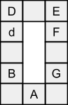

== Tríadas de PENTA

La escala `PENTA` tiene tríadas como las demás. Si se toman como en la notación estandar, parece que en lugar de terceras, están formadas por cuartas, así que se habla de _acordes por cuartas_, o _armonía cuartal_. Es totalmente absurdo. Lo que ocurre es que en esa escala no hay esas notas. Solo son las terceras de esa escala. No hay por que hacer excepciones. La diferencia con las tríadas de una escala que contenga tritonos es que estas no llevan a ninguna parte, funcionan todas igual de bien. Son todas igual de estables y no hay que alejarse de ningún punto. 

== Tríadas no orientativas

Un acorde puede usarse para marcar el grado o no. Así, se puede tocar con acordes por encima del mismo grado sin desorientar al oyente, generalmente sugiriendo, por ejemplo con el ritmo, que no se está variando de grado, solo es una melodía hecha de tríadas. Así, los músicos de jazz, suelen improvisar usando acordes por cuartas (_quartal harmony_) sin acentuarlos  demasiado para no confundir al oyente, marcando los tiempos débiles o realizando dibujos rítmicos irregulares, más propios de una melodía que de una báse armónica. Incluso el bajo puede hacer lo mismo, improvisar sobre una estructura armónica sin cambiar su carácter, simplemente dejando claro que no es lo que desea hacer, bien mediante el esquema rítmico, el sonido usado, o cualquier otro truco. De lo que se trata es de que el oyente diferencie claramente en qué grado está la escala en cada momento, para que que pueda analizar y asimilar todo lo que oiga por encima.

== Notas de color

Cuando se agregan más notas a una tríada, se dice que le estamos agregando _color_. Es una forma de verlo. No es muy util, porque parece que simplemente estamos decorándola para que luzca un poco más bonita. +
En realidad, cada nota que se añade tiene una función concreta. Una tríada por sí sola solamente aporta información mayor o menor. Todas las notas que agreguemos aportarán información sobre la posición del grado con respecto a la escala y posiblemente alguna idea más como anticipar modulaciones o inducciones al engaño, debilitando ligeramente la sensación inicial. +
La única idea clara que se enseña oficialmente es que agregar una _séptima bemol_ convierte a una tríada en _dominante_ (gran término) y provoca que resuelva en un grado que está una cuarta por encima. Y a partir de ahí empieza a aparecer el concepto “_puedes agregar_” que dice que a un acorde dominante, para darle _color_, se le pueden agregar una novena bemol, una novena aumentada, una quinta bemol, una quinta aumentada....  +
Otra vez la misma respuesta: ¿Se le “puede”? Y otra vez esas palabras malsonantes... +
Será mejor que dejemos de hablar de colores.

== Representación de tritonos 
Al representar los tritonos se observa que también ocupan su lugar perfectamente simétrico. Se hará mediante una flecha que los una. Veamos la representación de todas las escalas con sus tritonos.

.Escalas y sus tritonos
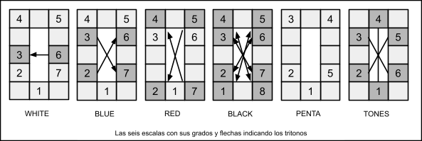

Como se puede observar, la escala `WHITE` (escala mayor diatónica, la más usada en música clásica) solamente tiene un tritono.  +
La escala `BLUE` (recordemos, en terminología estandar, _menor melódica_) es, con mucho, la más utilizada en el jazz. Tiene dos tritonos y eso permite una mayor capacidad para el engaño y la sorpresa, variando casi imperceptiblemente entre la sensaciones mayor/menor y menor/mayor. +
La escala `RED` se utiliza ampliamente en el flamenco, también con dos tritonos. +
La escala `BLACK` tiene 4 tritonos, se utiliza mucho en la música clásica cuando se desea remarcar la sensación tritonal, sin paliativos ni trucos, no ofrece ningún espacio para el relax y suele usarse durante periodos cortos. +
La escala `PENTA` no tiene ningún tritono. No hay amenazas, se utiliza en la música simple, básicamente en todas las civilizaciones primitivas. No hay posibilidad de engaño ni de sorpresa. Es más bien decorativa, adecuada para el adorno de fiestas y expresiones primarias. Sus tríadas dan lugar a un tipo de armonía llamada _armonía por cuartas _ +
La escala `TONES` tiene tres tritonos, pero solamente seis notas y además, no tiene orientación posible. Hablaremos de esto más adelante. +
Es importante observar que la situación de los tritonos tiene un sentido, es decir, puede no ser lo mismo ir de una nota a la otra ascendiendo que descendiendo, eso depende de si hay las mismas notas entre ambas por los dos caminos. Vemos que en `WHITE`, ascendiendo tenemos en medio 2 notas, sin embargo, descendiendo quedan 3. Así que si vamos apilando notas alternas, que es como se crean los acordes, girando en sentido reloj, es decir, ascendiendo, entre 6 y 3, ambas notas caen en el acorde, pero girando en sentido glorieta, apilaríamos 3,5,7,2,4,6. Es decir, el grado 3 está mucho más lejos de llegar a tener un tritono que el 6, concretamente, cuatro niveles de apilamiento más lejos.  +
Esto mismo ocurrre con `BLUE` y con `RED`, aunque hay dos tritonos. +
Sin embargo, en `BLACK` nos encontramos con ocho notas en la escala, así que entre cada nota del tritono siempre quedan tres, da igual en qué sentido nos movamos.  +
También en `TONES` pasa lo mismo, aunque quedan solamente dos notas en cada sentido, con lo cual, mediante saltos alternos nunca podremos llegar a completar un tritono. Una situación muy extraña. Lo hemos representado mediante flechas sin punta para indicarlo. +
La sensación para el oyente de que la pila que está sonando está cerca o lejos del tritono se ha de contar siempre ascendentemente, es decir, cuántas notas alternas han de agregarse para que acabe sonando un tritono (si es posible).

== Centro tonal

Llamaremos _centro tonal_ a la nota central de la escala. En todas, es la nota que guarda la misma distancia con todos los tritonos por ambos caminos, descendiendo y ascendiendo. Se trata del grado más estable de todos. No confundir con el que ofrece una mayor sensación de relajación, ese es el que quede más lejos de algún tritono. La nota central no da sensación de relajación, sino de equilibrio. Podríamos decir que es el grado más _neutral_ de la escala. En la escala `BLACK` no hay ninguna nota que ocupe ese centro tonal, aunque es perfectamente simétrica, como las demás. 

== Terceras ambiguas

Algunas escalas tienen en alguno de sus grados una tercera ambigua, es decir, que podría ser una tercera mayor o también una tercera menor. Esto amplia mucho las posibilidades de engaño y de sorpresa, y es de gran ayuda para la _modulación_ que consiste en cambiar de tonalidad, es decir, seleccionar otra escala.

.Escalas con terceras ambiguas
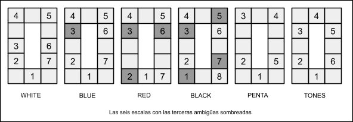

En este esquema observamos (marcados en tono oscuro) los grados que forman una tercera que puede ser mayor y también menor. 

* `WHITE` es perfectamente inequívoca, pues todas sus terceras son mayores o menores. 
* `BLUE` tiene una ambigüedad, en su tercer grado
* `RED` tiene tres: segundo, tercero y sexto.
* `BLACK` tiene cuatro en notas alternas, primero, tercero, quinto y séptimo. 
* `PENTA` no tiene ninguna ambigüedad: es directa, clara y simple.
* `TONES` no tiene ninguna ambigüedad, puesto que todas sus terceras son mayores, pero esto genera una débil capacidad para la orientación: el oyente no sabrá detectar con facilidad en qué grado de la escala estamos. 

La sensación de ambigüedad entre el caracter mayor/menor de una tríada produce inquietud en el oyente, y supone una especie de adivinanza que requiere una escucha atenta y activa. El mapa no está claro, y el camino es laberíntico, además hay muchas sorpresas esperando en cada cruce. Se necesita una actitud concreta para escuchar musica con muchas ambigüedades. El jazz utiliza con profusión la ambigüedad.

== Ausencia de terceras 

Si todos los grados de la escala tienen una tercera, mayor o menor, consideraremos que, al menos en ese aspecto, está completa. Podemos observar que, en la escala `RED` hay un grado que no tiene ninguna clase de tercera: el séptimo, así como en la escala `PENTA` faltan dos terceras, en el primer y en el tercer grado.

.Escalas con grados sin tercera
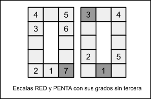

== Distancias a tritonos

Si en una escala hay tritonos, cada tríada estará a una distancia de ellos. La distancia representa para el oyente la probabilidad que tiene de que, agregando más notas al acorde llegue a oir un tritono. Es sencillo apreciar en este esquema de la escala `WHITE` que las dos tríadas más distantes al tritono son, por un lado la tríada `CEG` y por el otro `ACE`. +
Resulta que en notación estandar, a estas tríadas se les llaman _grado fundamental_ y _relativo menor_. A parte de la estrafalaria nomenclatura, son los grados que se utilizan para empezar y terminar la mayoría de los temas. Simplemente sugieren descanso y estabilidad, aunque uno es mayor y otro menor, así que además tienen su propio caracter. Si se termina en un acorde cercano al tritono, probablemente nadie aplaudirá: hay tensión sin resolver, preguntas sin contestar. 

.Escala WHITE con sus tríadas
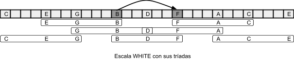

En esta otra figura observamos la escala `BLUE`, con sus dos tritonos y las tríadas correspondientes. Vemos que no hay una tríada que quede suficientemente alejada de un tritono, cuando nos alejamos de uno nos acercamos al otro. Se puede ver que las tríadas más “a salvo” parecen ser `CeG`, que necesitaría agregar `B`, `D` y `F` para contener un tritono, también `DFA` que necesitaría agregar `C` y `e` para lo mismo y `eGB` que necesitaría `D` y `F`. +
No es una escala muy cómoda, por esta razón: cuando llegamos a un grado da la impresión de que todavía necesitamos salir de ahí como sea. En la terminología estandar se habla de _tensión_. Es un término adecuado si lo entendemos como _pregunta sin responder_. En ningún caso debemos pensar en algo desagradable o repelente, solo es música.

.Escala BLUE con sus tríadas
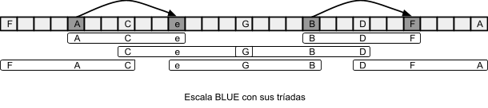

== No hay más escalas?

Buscar más es un interesante ejercicio. Sería fantástico encontrar alguna, pero las propiedades que hemos visto hasta ahora restringen las posibilidades.

* Que haya o no tritonos
* Que todos los grados tengan o no tercera
* Que todas las terceras sean mayores o menores
* Que formen una combinación simétrica

Cualquier combinación que se encuentre será simplemente una ordenación diferente de alguna de las seis presentadas ( lo que sería un modo, recordemos ). Si se hace girar en el esquema se llegará a ella. Vamos a intentar algunas:

.Otras posibles escalas
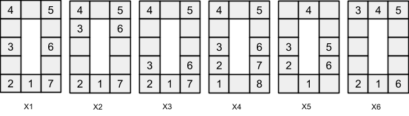

|===
|Escala|Terceras ambiguas|Sin tercera|Tritonos|

|X1|1 |0|3|
|X2|3|1|2|
|X3|2,||2|
|X4|3||3|
|X5|||2|
|X6|||3|
|===

== Orden de tríadas por distancias a los tritonos

En estás dos escalas `BLUE` y `WHITE` se aprecian los tritonos sombreados. La primera tiene uno: `B-F`, y la segunda tiene dos: `A-e` y `B-F`. Para modular entre una y otra basta con cambiar la nota `E` por `e` (`Mi` por `Mi bemol`). El centro simétrico era la nota `D` en `WHITE` y ahora pasa a ser `G` en `BLUE`. Veamos todas las tríadas de la escala y la distancia que guardan con el siguiente tritono, es decir, la cantidad de terceras que habría que agregarle para que contuviese un tritono. Anotaremos también si la tríada incluye ya alguna nota perteneciente a algún tritono. La distancia que percibe el oyente debería calcularse mediante alguna fórmula que tenga en cuenta ambos parámetros. De momento no sabemos qué fórmula será esa. 

=== Escala `WHITE`
.Escala white

|===
|TRÍADA|Distancia a un tritono|Contiene

|GBD|1|1
|BDF|0|2
|DFA|4|1
|FAC|3|1
|ACE|4|0
|CEG|3|0
|EGB|2|1
|===

=== Escala `BLUE`
.Escala blue

|===
|TRÍADA|Distancia a un tritono|Contiene

|ACe|0|2
|CeG|3|1
|eGB|2|2
|GBD|1|1
|BDF|0|2
|DFA|2|2
|FAC|2|1
|===

Comparación de distancias entre las dos tríadas. Observemos que la distancia a un tritono se mantiene en las tríadas `EGB` (que pasa a ser `eGB`), `GBD`, `BDF` y `CEG` (que pasa a ser `CeG`). 
 
|===
|TRÍADA|Distancia|Distancia|TRÍADA

|EGB|**2**|**2**|eGB
|GBD|**1**|**1**|GBD
|BDF|**0**|**0**|BDF
|DFA|4|2|DFA
|FAC|3|2|FAC
|ACE|4|0|ACe
|CEG|**3**|**3**|CeG
|===

De la misma forma, podemos observar que algunas tríadas siguen conteniendo la misma cantidad de notas de algún tritono al cambiar de escala.
|===
|TRÍADA|Contiene|Contiene|TRÍADA

|EGB|1|2|eGB
|GBD|**1**|**1**|GBD
|BDF|**2**|**2**|BDF
|DFA|1|2|DFA
|FAC|**1**|**1**|FAC
|ACE|0|2|ACe
|CEG|0|1|CeG
|===

== Mapa de la situación

Si esto fuese un mapa y cada tríada fuese un punto, podríamos considerar la posición de los tritonos como una elevación en el terreno. La pendiente que se genera alrededor hace que las cosas tiendan a alejarse de esos punto, digamos que nos cuesta acercarnos a ellos.  +
El oyente percibe el mapa sonoro como un conjunto de puntos que mantienen una posición con respecto a esa elevación del terreno. Para ponernos de acuerdo, llamémosle _centro tritonal_.

Ahora tenemos dos conceptos distintos: 

. *Centro tonal*, recordemos, la nota más neutra de la escala, a igual distancia de todos los tritonos y en el centro simétrico de la escala
. *Centros tritonales*, especie de elevaciones del terreno cuya pendiente circundante ejerce una fuerza que nos aleja de ellos

Si cambiamos la posición del centro tritonal, el oyente se sentirá desorientado: tendrá que calcular de nuevo hacia dónde tiene que "escapar", buscando algún punto de referencia lo más rápido posible o perderá el hilo del tema.  +
Modulando correctamente, podemos cambiar algunas de las notas, pasando a otra escala, pero manteniendo la posición del centro tritonal, con lo cual, la sensación de desorientación será mucho más debil.  +
El truco consiste en cambiar el centro tonal sin que se mueva el centro tritonal. Pero cómo es posible? Bueno, podemos, sencillamente, dejar el centro tritonal que tenemos donde está pero agregar otro más. Si la _pendiente_ del grado en el que estamos (es decir, su posición con respecto al centro tritonal anterior) sigue siendo la misma, el oyente no perderá la orientación, sin embargo, se habrá cambiado el centro tonal.

== Notación circular

En el ejemplo, con una notación circular, más práctica para el análisis de la orientación, entre `WHITE` en `D` y `BLUE` en `G`, observamos que simplemente se agrega un nuevo centro tritonal, pero el que teníamos sigue manteniéndose en el mismo sitio. Así que no hay mas que “girar el mapa” para volver a orientarse. +
En resumen: hemos cambiado la nota `E` por `e`, pero el centro tritonal no se ha movido ni un palmo, simplemente ha aparecido uno nuevo entre `A` y `e`. En el mapa imaginario había una elevación en el terreno, que formaba una pendiente a su alrededor. Ahora hay dos. Pero en algunos puntos, la pendiente sigue siendo idéntica, y en la misma dirección. Esa es la _sencilla_ razón de que algunas modulaciones sean más cercanas o agradables al oído que otras. 

.Desde WHITE D a BLUE G
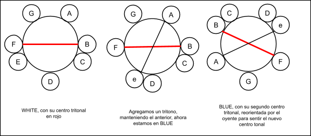

.Desde WHITE D a BLUE D

.Desde WHITE D a RED E

En más resumen todavía: resulta que cambiando `E` por `e`, estamos cambiando el caracter de la tríada `CEG`, de mayor a menor. Estamos cambiando sigilosamente entre alegría y tristeza. Estamos _jugando_. +
Posiblemente estemos mostrando disimuladamente la cruel dualidad de nuestro mundo, la diferencia entre oprimidos y poderosos, entre justicia e injusticia, entre opresión y libertad, entre triunfo y fracaso, entre vida y muerte... Probablemente estemos usando la música para dar una bofetada en la cara al cruel occidente y a sus estiradas reglas. Quizá estemos cantando una vitalizadora mezcla de humilde y resignado lamento y de alegría de vivir. Quizá descendamos de un pueblo oprimido, traido de otro continente y nuestros antepasados fuesen vendidos como esclavos.  +
_Estamos tocando jazz?_

Otro ejemplo de modulación muy utilizado, entre `WHITE` de `D` y `RED` de `E`. Simplemente agregamos un tritono pero la orientación sigue manteniéndose. Aquí las dos tríada más lejanas a un tritono pasan a ser `EaB` y `FAC`, puesto que `CEG` pasa a ser `CEa` (dos terceras mayores apiladas). +
Lo cierto es que llevaba años preguntándome cómo es que cantaores flamencos no se cansan nunca de esos dos acordes, `EaB` y `FAC`. Ahora lo veo claro, son los dos más estables de la escala, y de los pocos que tienen una tercera. Puedes estar pasando de uno a otro constantemente sin ver la posibilidad de salir de ahí, a no ser que vuelvas a la escala `WHITE`, haciéndo desaparecer el amenazante tritono entre `A` y `e`. Basta con saltar a la tríada `ACE`, lo cual hacen la mayor parte de las veces, para luego volver a `GBD`, a `FAC` y de nuevo a `EaB`. Olé!

.De WHITE D a RED E y su rotación
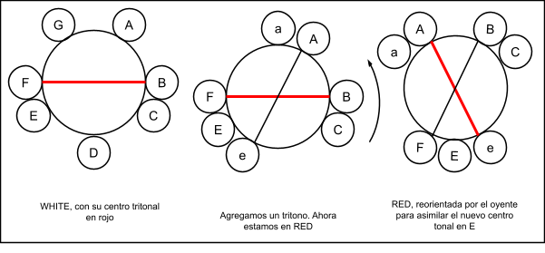

== Nombres para las tríadas

Por qué las tríadas tienen esos curiosos nombres en la notación estandar? _Mayor, menor, menor quinta bemol, mayor quinta aumentada, disminuida..._ +
Se trata de nombres del pasado, que simplemente han subsistido hasta ahora por falta de un buen comité de estandarización _ISO_. Si quisiera poner un ejemplo claro de elección de nombres farragosos, inservibles, molestos y fuera de toda razón lógica usaría estos. +
Para empezar, no me sirve de nada conocer la distancia de la tercera nota a la primera: lo que me interesa es el tamaño de los dos pares de notas. Esta es una tabla con las distancias que aparecen en todas las escalas. En la columna izquierda, las distancias en semitonos como un par de números, que indican el tamaño del intervalo inferior y el del intervalo superior partiendo desde `C`. En *negrita* los esquemas más usados, *43* ( tríada mayor) y *34* ( tríada menor).

|===
|Tríada|C|d|D|e|E|F|g|G|a|A|b|B

|23|X||X|||X||||||
|33|X|||X|||X|||||
|*34*|**X**|||**X**||||**X**||||
|42|X||||X||X|||||
|*43*|**X**||||**X**|||**X**||||
|44|X||||X||||X|||
|45|X||||X|||||X||
|54|X|||||X||||X||
|55|X|||||X|||||X|
|===

Vamos a cambiar la notación utilizando un poco de lógica.  +
Primera regla de oro para inventar nombres: _no inventar nombres innecesariamente._  +
Si los números que definen los intervalos de las tríadas las describen perfectamente, son directamente deducibles desde las propias notas, son más fáciles de escribir, ocupan menos espacio, se pronuncian en menos sílabas y son portables a todos los idiomas, entonces deberíamos usar la notación numérica. +
Así que, desde ahora hablaremos de una tríada menor como una tríada `4 3`. 

En esta tabla vemos el tipo de tríadas que tiene cada escala y en qué grado aparecen, así como el nombre de la combinación en notación estandar, si es que existe alguno.

|===
|_ESTANDAR_|_NUM_|*WHITE*|*BLUE*|*RED*|*BLACK*|*PENTA*|*TONES*

|menor|34|1,2,5|4,5|2,3,4,5|1,3,5,7|4|-
|mayor|43|3,4,7|1,7|1,2,3|1,3,5,7|5|-
|menor 5b|33|6|2,3|2,4,5|TODOS|-|-
|mayor 5+|44|-|**1**,**3**,6|1,3,6|-|-|TODOS
|??|42|3|3,6,7|5|1,3,5,7|-|TODOS
|??|23|1,4,5,7|1,2,4|7|2,4,6,8|1,3|-
|===

Ahora tenemos nombres más eficientes y lógicos para conceptos, como “Mayor con la quinta aumentada”, ó, uno especialmente chirriante: “Tríada disminuída”. +
Es cierto que memorizamos mejor los nombres que los números, y posiblemente, cuando lleguemos a acordes de cinco o más notas, hablar de un acorde `3 3 4 3 4` puede ser también un poco engorroso. Así que probablemente se haga necesario crear alguna nomenclatura. Pero no nos precipitemos.

== Las tríadas de cada grado de todas las escalas

En cada escala, los tipos de tríada dependen lógicamente de la estructura de la escala. Veamos una tabla. Algunos tipos de tríadas son más comunes que otras. 
|===
|_GRADO_|*WHITE*|*BLUE*|*RED*|*BLACK*|*PENTA*|*TONES*

|1|43|34|34|33|55|44
|2|43|33|34|33|55|44
|3|34|33|43|33|45|44
|4|34|43|33|33|55|44
|5|43|43|24|33|54|44
|6|33|44|44|33|-|44
|7|34|34|32|33|-|44
|===

Intentemos buscar, una vez más, un poco de simetría

.Tríadas simétricas en vertical
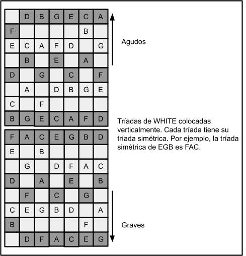

.Tríadas simétricas en horizontal
image::../images/horizontal-triad-symmetry.png[]

No parece muy importante que cada tríada tenga una simétrica. Pero es así. Hay pares de grados simétricos, igual que pares de notas, obviamente. Aunque son simétricas al revés, puesto que una tiene la misma estructura ascendente que su simétrica descendente. Bueno, en realidad eso es exactamente lo que significa “simétrico”. Si no serían iguales. Quizá más adelante encontremos alguna utilidad a esto.

== Una concha de caracol

En general, aunque observamos esa simetría perfecta en todas las escalas, hay que considerar también que las notas siguen un camino ascendente de grave a agudo. Aunque pueda parecer que esto es indiferente, resulta que los sonidos graves tienen mayor preponderancia que los agudos: sus ondas son más largas y se propagan en todas direcciones. Los sonidos más agudos se propagan mejor en linea recta, son ondas más cortas y no rebotan tan fácilmente. Por eso, cuando nos ponemos una mano delante de la oreja, notamos un descenso en el nivel de agudos, aunque seguimos oyendo los sonidos graves practicamente con igual intensidad.  +
Hablando más “musicalmente”, las notas más agudas admiten mejor las mezclas, sin enturbiarse demasiado. Las notas graves, al mezclarse “emborronan” un poco el sonido, siendo, en general, notas únicas que marcan la base del acorde, sobre las que se agregan otras. +
El oyente tiende a analizar las notas de abajo a arriba. Quizá, en un instinto atávico de supervivencia, los sonidos graves han de analizarse con máxima prioridad, ya que sugieren cosas grandes, fuertes, pesadas, importantes... en suma, cosas a las que se debe prestar atención, por si representan un peligro. Los sonidos agudos pueden analizarse con más calma, ya que suelen provenir de elementos de pequeño tamaño, ligeros y, en general, menos peligrosos. Claro que hay excepciones, pero, es una regla instintiva general. Si vamos a cruzar la calle y por un oido nos entra un sonido de camión y por el otro el de una bicicleta, probablemente nos lancemos hacia el lado de la bicicleta sin ni siquiera girar la cabeza para ver qué pasa. Mediante sencillos trucos como este, hemos llegado vivos hasta nuestros días.  +
Ocurre algo parecido con el ojo humano: tiene mucha menor capacidad para detectar el color azul que los colores rojo y verde. Por qué? Bueno, hay muchas menos cosas azules en la naturaleza a las que prestar atención. Una es el mar, la otra el cielo en verano. Ya no se me ocurren más. Sin embargo hay muchas cosas verdes en nuestro camino, y, atención, muchas cosas rojas, entre ellas, un par bastante urgentes: el fuego y la sangre. Quizá algún antepasado nuestro nació con más células detectoras de color azul que de rojo y verde, pero posiblemente las cosas no le fuesen demasiado bien y la cruel evolución hizo su trabajo inexorablemente.  +
En fin, la diferencia entre sonidos graves y agudos debería formar parte de nuestro análisis de manera importante. Es cierto que hay simetría en las escalas, y su observación facilita mucho su comprensión, pero se trata de una rara simetría inserta en una especie de espiral ascendente que va decreciendo de tamaño. Una especie de concha de caracol ( un objeto bastante propenso al analisis matemático, por cierto ) sobre la que las notas estan colocadas. 

== Posición y forma

Así que, según hemos concluido, el oyente considera un acorde  como un conjunto de notas agudas apiladas sobre notas graves, y no al revés. De algún modo, las notas graves marcan la situación del grupo de notas, y las agudas definen la forma del mismo.  +
Si volvemos al simil del mapa y del terreno, la nota grave nos indica en qué punto del mapa estamos y las notas agudas indican, digamos, qué relación guarda ese objeto con el resto del mapa, es decir, nos ayuda a imaginar el resto del mismo.  +
Si en el terreno vemos un punto, sabremos dónde ese punto, pero si además vemos que ese punto es un arbol, nos indicará que probablemente estamos en un bosque. Si resulta que el punto tiene forma de edificio, seguro que estamos en pleno centro de la ciudad. Así es como, con un simple acorde, nos hacemos una idea de cómo es el resto del mapa y en qué punto nos encontramos del mismo. Claro que hay puntos que podrían ser árboles o edificios (tríadas con la misma estructura). Así que todavía hay espacio para la sorpresa. +
De manera que podríamos decir que cada pila de notas nos aporta dos tipos de información: 

- La estructura de la escala de la que forma parte 
- La posición donde se encuentra en la misma. 

Podemos acuñar dos nuevos términos para esto, información _estructural_ y la información _posicional_. Cuando hablamos de las sensaciones que nos producen las tríadas mayores y menores, de alegría o tristeza, simplemente mostrábamos tríadas separadas, sin saber a qué escala pertenecían, y aún así nos transmitían esa idea. Podemos concluir que la estructura tríada tiene la mayor cantidad de información estructural lo más clara posible. Cuando vamos apilando notas encima, se va perdiendo un poco de información estructural y se gana información posicional, es decir, se presenta más “trozo de mapa” para que el oyente pueda saber cuál es el terreno y dónde está en este momento.

== Ordenación de los grupos de notas

Como dijimos, el centro tonal de una escala lo marca la nota que queda a la misma distancia de los tritonos, digamos la nota más neutra. Qué pasa cuando apilamos notas? Se mantendrá la misma simetría? Pasará algo inesperado? Me temo que sí, al menos para mí. +
Veámoslo en una tabla.

.Pilas de notas

Cuando tenemos simplemente una nota, observamos que, en la escala `WHITE`, el centro es la nota `D`. Dijimos que marcaba el centro tonal. Es el centro simétrico de la escala y está a la misma distancia del tritono, tanto hacia arriba como hacia abajo. +
Cuando apilamos dos notas alternas, los pares que se forman pueden ser de 3 o de 4 semitonos. Si nos fijamos en el esquema, el centro simétrico ahora pasa a ser la nota `C`. Hemos bajado un tono. +
Al apilar tres, para formar una tríada, obtenemos pilas `43`, `34` y `33` de manera que ahora, el centro simétrico pasa a ser la tríada formada a partir de la nota `B`. Recordemos que las tríadas tenían un fuerte significado debido a su forma: justicia/injusticia, bien/mal, vida/muerte, alegría/tristeza, etc.  +
Si usamos cuatro notas, el carácter de las tríadas pasa a un plano secundario. Ya no vemos una entidad grande apoyada sobre una más pequeña. Ahora hay tres entidades, formando distintas combinaciones. Si teníamos arriba un grande opresor sobre uno pequeño oprimido, ahora el de arriba también soporta a otro pequeño, así que parece más equilibrado, y al revés, si había uno pequeño apoyado sobre uno grande, lo cual nos parecía justo, ahora el pequeño tiene a su vez otro grande encima. En resumen, se difumina un poco la sensación de desequilibrio grande/pequeño. Sin embargo, al agregar más notas, disminuye también la posibilidad de confusión: ya no hay tantos acordes comunes. Teníamos 3 tipos de tríadas (`43`, `34` y `33`) con lo que `F`, `C` y `G` podrían confundirse, `E`, `A` y `D` también y solo era diferente `B`.  +
Ahora tenemos cuatro tipos de cuatríadas (`334`, `344`, `433`, `334`) así que `E`, `A` y `D` siguen siendo iguales, `F` y `C` también pero `G` y `B` son distintos. Hemos conseguido diferenciar a `G` y a `B`. Además hemos vuelto a bajar de grado: ahora el centro simétrico está en la tríada de `A`. +
En resumen: observamos que cuantas más notas apilamos, más baja el centro simétrico. Es curioso, pero qué podría significar? Sigamos razonando... +
Desde luego, no es el centro tonal de la escala. Sea cual sea la cantidad de notas que apilemos, el oyente sigue percibiendo el mismo centro tonal, y sobre todo, los mismos tritonos. Conoce la orientación del mapa correctamente. Eso no cambia. Qué estamos cambiando entonces? +
Recordemos de qué manera medíamos la distancia al tritono de un grupo de notas. Considerábamos la cantidad de notas que hay que agregar al grupo para que contenga un tritono. Suponemos que el oyente hace esto de manera automática. Es como si completase las notas que faltan y notase que está cerca de escuchar un tritono. Nos quedamos en que debería haber alguna fórmula para calcular correctamente la distancia al tritono que se percibe y que probablemente, el hecho de que en el grupo de notas ya estuviese presente una nota perteneciente al tritono, aumentaría esa percepción.

.Partículas básicas
image::../images/basic-particles.png[]

Si estuviésemos hablando de una materia formada por partículas, estas serían las combinaciones básicas. En primer lugar tenemos la tercera mayor y luego la tercera menor. Esas serían las partículas atómicas. Apilándolas obtendríamos los “ladrillos” básicos: la tríada mayor, la tríada menor y la tríada disminuida, recordemos, resumiendo mucho: justicia, injusticia y pregunta sin contestar, respectivamente. Con partículas de este tipo, ya podríamos construir el 90 % de la materia universal. Para materia más compleja, usamos pilas de cuatro notas, es decir, una de las pilas anteriores con una nota más encima. Esta combinación comparte la partícula central, así que tenemos por ejemplo una tríada mayor sobre una tríada menor.  +
Con partículas de cuatro notas tenemos una pila de dos elementos básicos, que no comparten notas. +
Con cinco notas, es complejo entender cómo observa el oyente las pilas. Si quizá el elemento central actúa como separador de los dos elementos inferior y superior, o si se entiende como un todo. +
Con seis notas resulta muy dificil obtener un significado. +
Pero una cosa está clara: en cada nivel hemos ido agregando más pistas sobre la cercanía del tritono. De manera que en el último nivel, todas las pilas menos dos contienen un tritono. E incluso esas dos, lo contienen invertido. +
Podríamos concluir que en los niveles iniciales, lo que prima es la estructura de la pila y su significado para el oyente. Según vamos agregando notas, el significado se va diluyendo y lo que importa es la situación del tritono, la indicación al oyente de en qué punto de la escala estamos de manera inequívoca, sea para orientarle o precisamente para engañarle en la siguiente curva del camino.

Analicémos entonces el significado correspondiente a cada partícula base.

.Significado de las partículas

Las dos últimas son especialmente interesantes y ambas estan presentes especialmente en la música moderna. La pila `434` recibe en notación estandar el nombre de _acorde mayor con séptima mayor_ y produce una sensación de cierto relax obscuro e indolente, muy apto para baladas románticas, perezosas y sensuales. Si el elemento central de la tríada fuese una persona sería un ser debil que se se apoya sobre uno fuerte pero a su vez siente encima el peso de otro. Un ser debil que siente la contradicción de la _doble moral_, por una parte debería quejarse debido al peso que le oprime, pero por otra disfruta de la solidaridad y el soporte que recibe. Así que permanece en silencio, aceptando su destino y añorando que su situación cambie. En cuanto a la pila `343`, en estandar es un acorde _menor con séptima_. En este caso, el elemento central del esquema sería un ser fuerte, que soporta a un ser debil encima, pero que también está apoyado sobre otro debil. Cómo puede sentirse? Si el de la tríada anterior ocultaba su queja por la doble moral, este debe ocultar su alegría, puesto que no está sufriendo, ya que soporta a un ser más debil que él. Puede que se sienta culpable por oprimir a un debil pero diríamos que está en paz consigo mismo, puesto que ya está pagando su deuda. “Sé que otros sufren por mi culpa, pero ya contribuyo con mis buenas obras, así que olvidemos la injusticia y disfrutemos de la vida”. Esto sugiere civilización, sociedad, avance, optimismo. Un ermitaño que vive en el desierto nunca sentirá esa sensación, su vida diaria no contiene ventajas a costa de que otros sufran, simplemente no hay otros. Si vives en una sociedad moderna, todo funciona gracias a que los servicios que utilizas los pagas con tu trabajo. Otros trabajan para que tú estés cómodo, pero tú también trabajas para que otros lo estén. Así funciona, es la base de la sociedad de consumo. Estos acordes se utilizan profusamente en la música pop, en el jazz, la bossa nova, en el rock, y en general en toda la música moderna. Son poco comunes en música tradicional, incluso en música clásica: parece que suenan demasiado “modernos”. 

== Nombres para las partículas

.Nombres para las partículas

Asignaremos nombres básicos a nuestras partículas básicas, para pensar de forma un poco más cómoda. Si llamamos a la tríada disminuida (la del *t*ritono) `T`, a la tríada m*a*yor `A` y a la tríada m*e*nor `E`, entonces, las pilas de cuatro notas se llamarán `TE, AT, AE` y `EA`. Parece útil y resulta fácil deducir el nombre a partir del dibujo o de las notas, solo memorizando tres letras. Veamos entonces las pilas de cinco notas y sus posibles nombres:

.Agregar un guión en el nombre

Como vemos, llamarle a las pilas de tres notas con las dos letras, aún cuando el elemento central se comparte en ambas, nos ha costado tener que agregar un guión en medio (-) para indicar que un elemento completo está encima del otro. Por ejemplo, la pila `AE` contiene dos pilas de tres notas pero comparten las dos notas centrales, así que en total son cuatro notas, pero en la pila `A-E` hay dos pilas una encima de otra y comparten la nota que queda en medio, así que en lugar de 6 nos quedan 5 notas. Vale la pena. Veamos las de seis y siete notas:

.Pilas WHITE

No parece muy fácil de pronunciar. Pero, al menos, es una nomenclatura uniforme y simple: puede deducirse a partir de las pilas de notas. +

WARNING:: Recordemos la regla: cuando es un número impar de notas, usamos una guión en medio de las letras para indicar que las dos pilas comparten la nota central. 

Si no hay guión, significa que el número de notas es par, así que las dos pilas comparten las dos notas que quedan en el centro. Así que, `AETA` significa una pila `AE` que comparte la partícula central con una pila `TA`, en cambio `AE-ET` significa que las dos pilas comparten las dos notas centrales. (Podría usarse como regla nemotécnica la idea de que los cuadrados son intervalos, de modo que sus aristas horizontales son las notas que los forman. Por ejemplo, la pilas de tres notas se representan con dos bloques, que tienen tres aristas horizontales, así que cada arista es una nota de la pila) +
Tenemos pues un sencillo catálogo de pilas de notas, con sus nombres. Los significados intrínsecos están claros para las pilas de tres notas y para las de cuatro. A partir de ahí, el significado deja de tener importancia y pasa a primar la información posicional, es decir, la relación con el tritono de la escala. +
De momento hemos hecho todo esto con la escala `WHITE`. Vamos a intentar lo mismo con `BLUE`.

.Pilas BLUE

Observamos, por supuesto, la misma simetría y el mismo descenso por grados con cada nueva nota. Sin embargo, aparece una nueva partícula con la que no habíamos contado aún: la tríada `44`. Tendrá que formar parte de nuestro vocabulario. La sensación que produce esta tríada tiene que ver con la orientación. Se trata de dos terceras mayores, no se sabe cuál es la base porque podría ser cualquiera, al estar a distancia de 4 semitonos, apilando 3 de ellas llegamos a la octava, es decir, se termina la escala. Esto es lo mismo que le ocurre a la escala `TONES`, no tiene orientación. El oyente siente la presencia de tritonos por todas partes, no hay ningún lugar seguro, no se puede huir en ninguna dirección. Da lo mismo en qué grado de la escala estemos, la sensación persiste: amenaza constante y ninguna posibilidad de escape. La diferencia con `PENTA`, donde no hay ningún tritono es apreciable, aunque allí sí hay una orientación: se sabe en qué grado de la escala estamos, pero no hay necesidad de huir de ningún punto. La tríada `44` crea una sensación de perplejidad y de amenaza irremisible. +
Este sería nuestro nuevo diccionario de partículas básicas:

.Nuevo diccionario de partículas básicas

Al agregar todas las combinaciones únicas que aparecen en `BLUE`, nuestro vocabulario se amplía:

Hagamos lo mismo con `RED`, usando `E` como centro tonal.

.Pilas RED

Nuevas partículas! Hemos hallado un nuevo intervalo de 2 semitonos, así que aparecen dos nuevas tríadas: `24` y `42`. Las hemos representado con fondo negro. La simetría sigue siendo perfecta. Cuál será el significado de estas tríadas? +
Vamos a crear la tabla

.Pilas RED con nombres

Bien, hemos de considerar la dificultad intrínseca de cada escala como parte del problema. Digamos que el oyente se sentirá mejor en una escala con pocos tritonos y pocos grados equívocos. Si cada escala tiene algun sonido concreto que la caracteriza, el hecho de presentar al oyente ese sonido hará que se crea que estamos en esa escala. Recordemos que la tríada `44` aparecía en `BLUE` y no en `WHITE`, de manera que actúa como una especie de _aroma inconfundible. _Por contra, las pilas `24` y `42` hacen su aparición en `RED`. Tampoco parecen tener un significado especial, más que representar a su escala. +
Las 6 escalas forman un simple esquema donde se expresan tres conceptos básicos: _claridad, oscuridad y desorientación_. Al analizar cada una, vimos que había diferencias en la cantidad de tritonos, la capacidad de orientación, la cantidad de pilas equívocas, etc. Consideramos la escala `WHITE` la escala central, la más equilibrada y completa. A partir de ella, eliminando tritonos vamos a parar a `PENTA`, agregándolos podemos llegar a `BLUE`, que es un poco desconcertante pero no tanto como `TONES`, o bién a `RED`, que es un poco más oscura, pero no tanto como `BLACK`.

.Sensación de las escalas
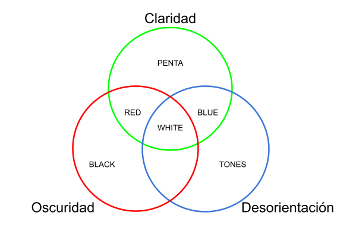

En resumen: las nuevas tríadas de nuestro vocabulario no tienen un significado específico, simplemente sirven como señales que indican en qué escala estamos (sea cierto o no) con lo que se creará una sensación claridad, obscuridad o desorientación. +
Este es nuestro vocabulario, de momento:

.Nuevo diccionario de partículas con una más

Ahora deberíamos preguntarnos lo siguiente: +
Si un bloque 4 sobre uno 3 significa “injusticia”, ¿por qué no ocurre lo mismo con un bloque 4 sobre uno 2 ? +
La respuesta a esta pregunta fundamental es simple. En el bloque `34` no aparecen trazas de ninguna otra escala, estamos en `WHITE` y no se detecta ninguna amenaza, el camino está claro, los puntos en el mapa se distinguen perfectamente y hay una pendiente por la que caen las cosas alejándose de la _montaña-tritono_.  +
Con un bloque `24`, la sensación de justicia o injusticia desaparece inmediatamente debido a la señal de peligro que representa su estructura. Se trata de una alarma encendida, una puerta a lo desconocido, un imprevisto en el camino que hará que revisemos nuestra situación y nos preparemos para encontrarnos problemas: el camino que anuncia es, o bien, más oscuro y peligroso, o más sorprendente y equívoco. Sea lo que sea, no importa su forma, sino lo que ésta indica: problemas. +
Continuemos con `BLACK` y `TONES`

.Tritonos en BLACK y en TONES
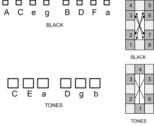

Hay un ligero inconveniente: una tiene 8 notas y la otra 6. Si las apilamos en notas alternas solo alcanzaremos la mitad de ellas. Se crean dos subconjuntos diferentes. Además de eso, cada nota forma parte de un tritono. Está claro que no son escalas muy útiles para armonizar, son una especie de pozos sin fondo o callejones sin salida. Volveremos sobre ellas más adelante.

Recapitulemos. Algunas pilas de notas anuncian el carácter de una escala, es decir, la claridad, oscuridad o desorientación de la misma. Sin embargo, algunas lo anuncian de una forma más exclusiva, más definitiva, que otras. Por qué? +
Algunas combinaciones de notas pueden obtenerse en varias escalas, cambiando simplemente la forma de apilar las notas. Cuando acostumbramos al oyente a las pilas de notas alternas, y escucha la pila `FAB` (una pila ´42´) puede pensar que hemos cambiado la forma de apilar y ahora apilamos dos notas seguidas (`A` y `B`), o bien puede pensar que estamos en una escala donde entre `A` y `B` hay una nota más, con lo que seguimos apilandolas de forma alterna. La única escala que tiene 3 notas seguidas es `RED`. Así que esa pila anuncia la oscuridad de una manera digamos _probable_.  +
Por el contrario, si aparecen las notas `CEa` (una pila `44`) eso anuncia irremisiblemente desorientación, puesto que solo empieza a aparecer en `BLUE`, y no puede conseguirse apilando las notas de `WHITE` de forma alguna. +
La sensación de desorientación es definitiva, se produce de manera inequívoca y directa, en cambio, la sensación de obscuridad se produce de manera más gradual: una vez que aparece el primer síntoma, todavía hay alguna probabilidad de que no sea cierta. +
En realidad, mientras para la desorientación solo hace falta la pila `44`, para la oscuridad disponemos de _dos puertas al averno_: la pila `24` y la `42`. +
Parece lógico que si son dos, se repartan de alguna manera el efecto. En el caso de la `24` el oyente se guía más por la tercera mayor y llega a pensar que está oyendo una pila que comienza en la segunda nota, así que cree que es un acorde de cuatro notas donde falta una. Cree que hemos olvidado apilar algunas notas, mientras que en la `42` cree que hemos decidido apilar las notas sin alternar. Son dos caminos diferentes para ser optimista y evitar pensar en lo peor: que hemos caido en la terrible escala `BLACK`, la oscuridad total.

.Mapa de pilas

.Equivalencias estandar de las pilas

.Pilas y nombres estandar

En esta tabla vemos las pilas de 3 y 4 notas de `WHITE`, `BLUE` y `RED`. Se ha numerado cada posición con números enteros de forma que el centro tonal ocupe la posición 0. Aquí se observa claramente, por ejemplo en las pilas de 3 notas las marcas de “sabor” de cada conjunto de notas, el sabor “básico” de `WHITE`, con su único tritono y su equilibrio perfecto, el sabor “desorientador” de `BLUE`, con la pila `-4` y el sabor “oscuro” de red, representado en las pilas `-1` y `-5`. Observamos también que que la desorientación de `BLUE` está presente también en `RED`, en la pila `-4`. +
En las pilas de 4 notas ocurre lo mismo pero en diferentes posiciones: la desorientación de `BLUE` aparece en las posiciones `-4` y `-5` y se comparte con `RED` en exactamente las mismas posiciones. La marca oscura de `RED` aparece ahora en tres posiciones: `-5`, `-1` y `4`.

.Nueva partícula en las pilas
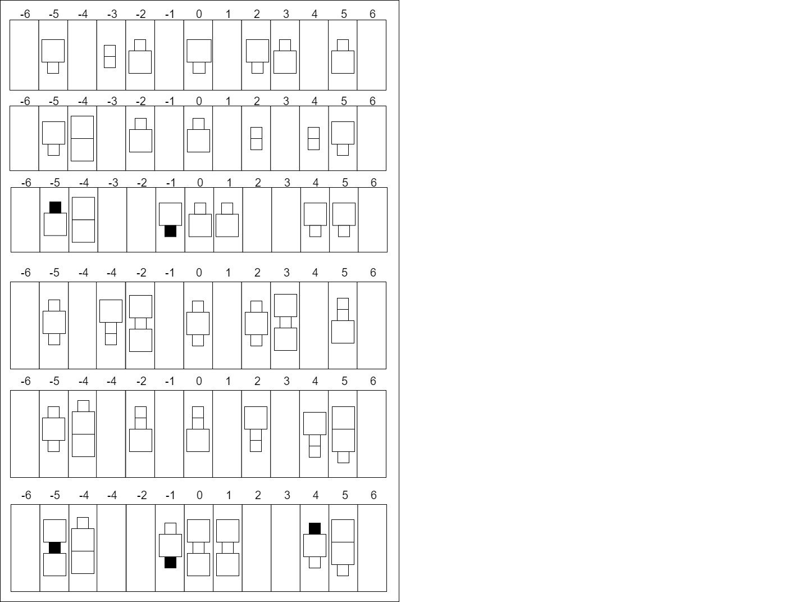